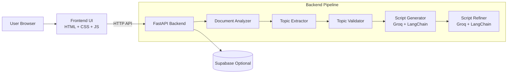
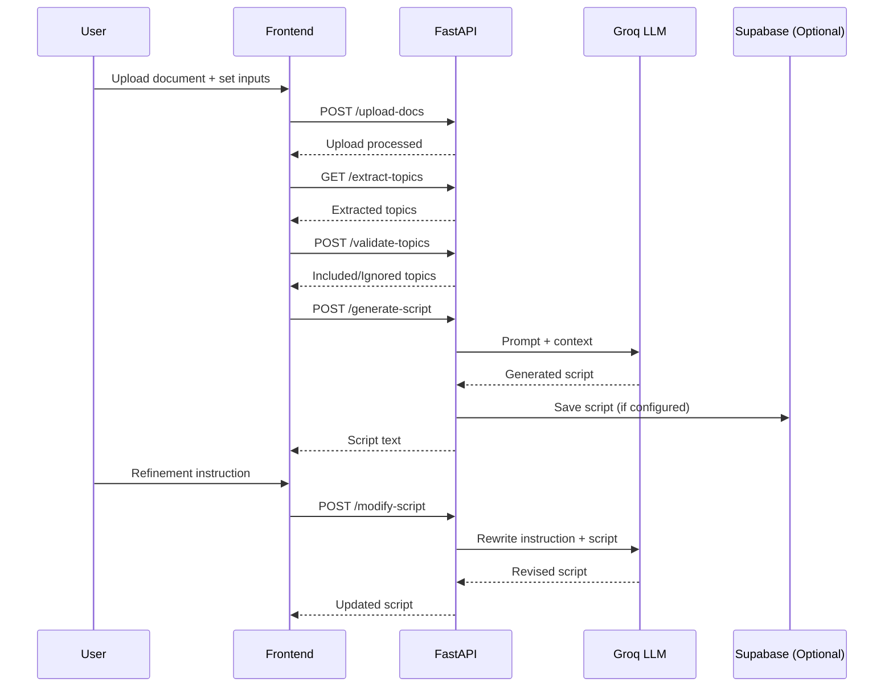

# PodCraft AI

PodCraft AI is a full-stack app that turns uploaded source material into a podcast script.

The project is intentionally simple:
- FastAPI backend for API + static frontend serving
- HTML/CSS/JS frontend for the workspace UI
- Groq LLM for topic-aware script generation and refinement
- Optional Supabase persistence for generated scripts

This README is written for developers who want to understand, run, and deploy the project quickly.

## What The App Does

1. Upload a PDF, DOCX, or TXT file.
2. Extract topics from the uploaded content.
3. Select topics and provide speaking metadata.
4. Generate a podcast script.
5. Refine the script with natural-language instructions.

## High-Level Architecture

- Frontend: static app in the frontend folder.
- Backend: FastAPI app in the backend folder.
- LLM integration: Groq via LangChain.
- Persistence: Supabase (optional).

Frontend and backend are served from one origin in local and container mode through FastAPI.

## Architecture Visuals

### Component Diagram



### Request Flow Diagram



### UI Layout Snapshot (Conceptual)

```text
┌──────────────────────────────────────────────────────────────┐
│ Sidebar / Header                                             │
├──────────────────────────────────────────────────────────────┤
│ Source Material                                              │
│ - Upload document                                            │
│ - Host/Guest details, speed, duration                        │
├──────────────────────────────────────────────────────────────┤
│ Extracted Topics                                             │
│ - Topic chips + generate                                     │
├──────────────────────────────────────────────────────────────┤
│ Script Output                                                 │
│ - Generated content + refine input + copy/export             │
└──────────────────────────────────────────────────────────────┘
```


## Project Structure

PodCraft-AI/
- backend/
  - config/: runtime settings and environment parsing
  - routes/: API endpoints (upload, topics, script)
  - services/: business logic (extraction, generation, refinement, storage)
  - prompts/: prompt templates and examples
  - utils/: shared helpers (session store)
  - main.py: app entrypoint, middleware, static mounting, health endpoints
  - requirements.txt: backend dependencies
- frontend/
  - index.html: UI structure
  - style.css: UI styling (including dark mode overrides)
  - script.js: UI behavior and API wiring
- docker/
  - Dockerfile: production container image
  - docker-compose.yml: local/production-like container run
- .env.example: sample environment configuration
- README.md

## Requirements

- Python 3.13+
- uv package manager
- Groq API key (required for generation)
- Supabase project credentials (optional)

## Quick Start (Local)

1. Clone repository and open project root.
2. Copy .env.example to .env.
3. Fill required values in .env.
4. Install backend dependencies.
5. Run FastAPI.
6. Open the app in browser.

Commands:

macOS/Linux:

    cp .env.example .env
    cd backend
    uv venv
    uv pip install -r requirements.txt
    uv run uvicorn main:app --reload --port 8000

Windows PowerShell:

    Copy-Item ..\.env.example ..\.env
    cd backend
    uv venv
    uv pip install -r requirements.txt
    uv run uvicorn main:app --reload --port 8000

Open:
- http://localhost:8000
- API docs: http://localhost:8000/docs

## Environment Variables

Required:
- GROQ_API_KEY: Groq API key.

Recommended:
- GROQ_MODEL: model name, default is llama-3.1-8b-instant.

Optional:
- SUPABASE_URL: Supabase project URL.
- SUPABASE_KEY: Supabase key.
- APP_ENV: development or production.
- DEBUG: true or false.
- LOG_LEVEL: INFO, WARNING, ERROR, etc.
- MAX_UPLOAD_SIZE_MB: max upload size in MB.
- ALLOWED_ORIGINS: comma-separated CORS origins.
- PORT: service port (used in container mode).
- UVICORN_WORKERS: number of worker processes.

## API Endpoints

- GET /: serves frontend index page.
- POST /upload-docs: upload source document.
- GET /extract-topics: extract topics from uploaded content.
- POST /validate-topics: compare user topics against extracted topics.
- POST /generate-script: generate podcast script.
- POST /modify-script: refine generated script.
- POST /reset: clear in-memory session state.
- GET /healthz: liveness probe.
- GET /readyz: readiness probe with config hints.

## Runtime Behavior And Limitations

- Session storage is currently in-memory.
- In-memory session means single-process/single-instance friendly behavior.
- For horizontal scaling or multi-instance workloads, switch session state to Redis or database-backed storage.
- Supabase persistence is optional; app still works without it.

## Features

- Document upload support for PDF, DOCX, and TXT.
- Automatic topic extraction with fallback logic.
- Topic validation showing included and ignored topics.
- Podcast script generation with host/guest metadata.
- Script refinement via natural-language instructions.
- Light and dark mode support.
- Health and readiness endpoints for operations.
- Optional Supabase persistence.

## Roadmap

Near-term improvements (simple, high-impact):

- [ ] Add basic automated API smoke tests.
- [ ] Add request/response examples in API docs.
- [ ] Improve Supabase error diagnostics and table validation.
- [ ] Add export to Markdown and DOCX formats.
- [ ] Add simple usage analytics for generation/refinement calls.

Mid-term improvements:

- [ ] Replace in-memory session with Redis for multi-user support.
- [ ] Add authentication and per-user script history.
- [ ] Add background task queue for large document processing.

## Docker Usage

From project root:

    cd docker
    docker compose up --build

The service runs on port 8000.

Container defaults include:
- non-root runtime user
- configurable worker count
- healthcheck through /healthz

## Minimal Production Checklist

1. Set APP_ENV=production.
2. Set DEBUG=false.
3. Set a valid GROQ_API_KEY.
4. Restrict ALLOWED_ORIGINS to real frontend domains.
5. Set MAX_UPLOAD_SIZE_MB to a safe limit.
6. Use /healthz and /readyz in infrastructure probes.
7. Store .env values in a secure secret manager for cloud environments.

## Troubleshooting

Frontend loads but API calls fail:
- Verify backend is running on port 8000.
- Verify ALLOWED_ORIGINS includes your frontend origin.

Script generation fails:
- Confirm GROQ_API_KEY is set.
- Check backend logs for upstream API errors.

No records in Supabase:
- Confirm SUPABASE_URL and SUPABASE_KEY are set.
- Verify podcast_scripts table exists.

## Supabase Table Example

Use this schema if you want to store generated scripts:

    create table podcast_scripts (
      id uuid default gen_random_uuid() primary key,
      host_name text,
      guest_name text,
      topics text[],
      duration int,
      script text,
      created_at timestamptz
    );

## License

This repository currently does not include a license file.

Until a LICENSE file is added, all rights are reserved by default.

Recommended next step:
- Add a LICENSE file (for example MIT) if you plan to open-source the project.
